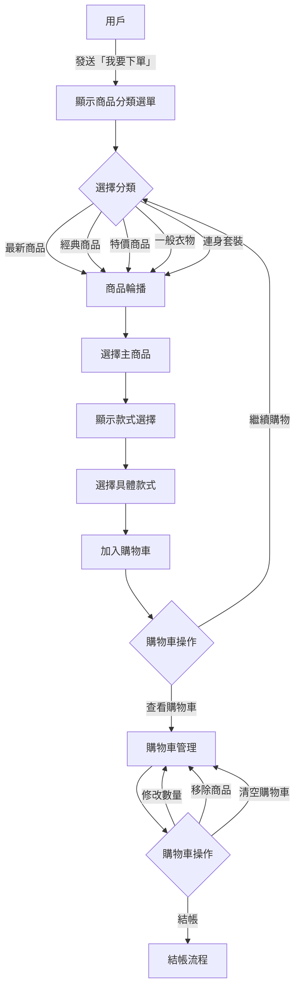
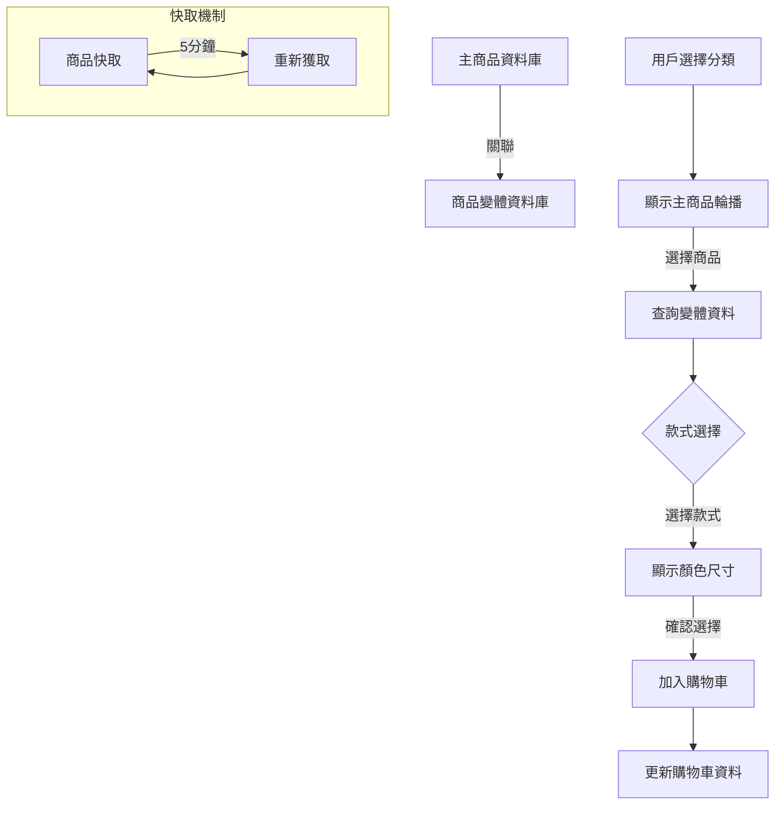
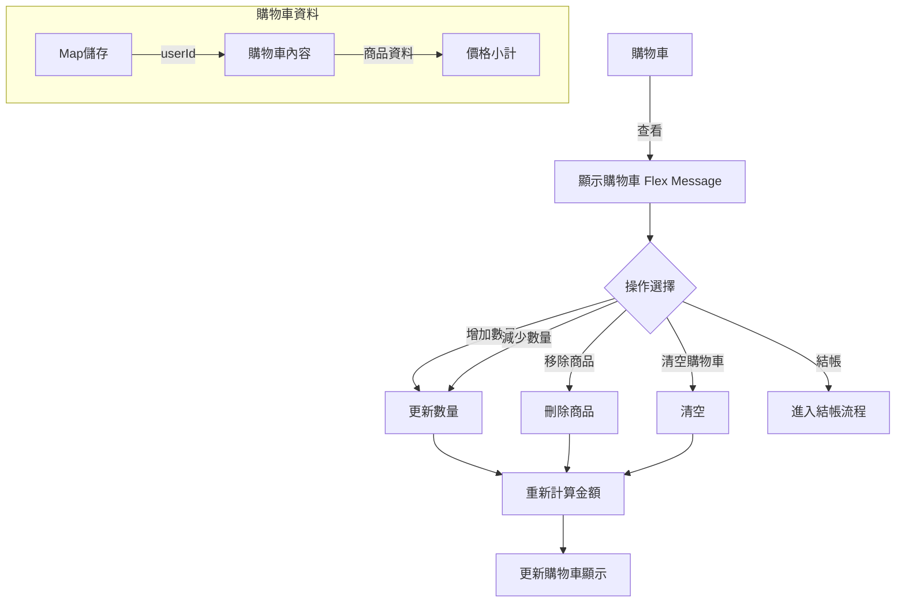
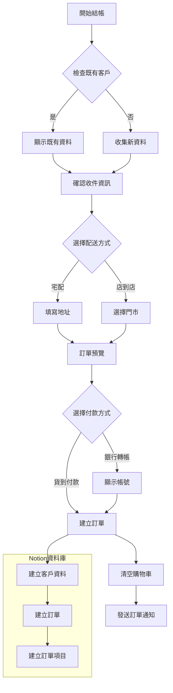
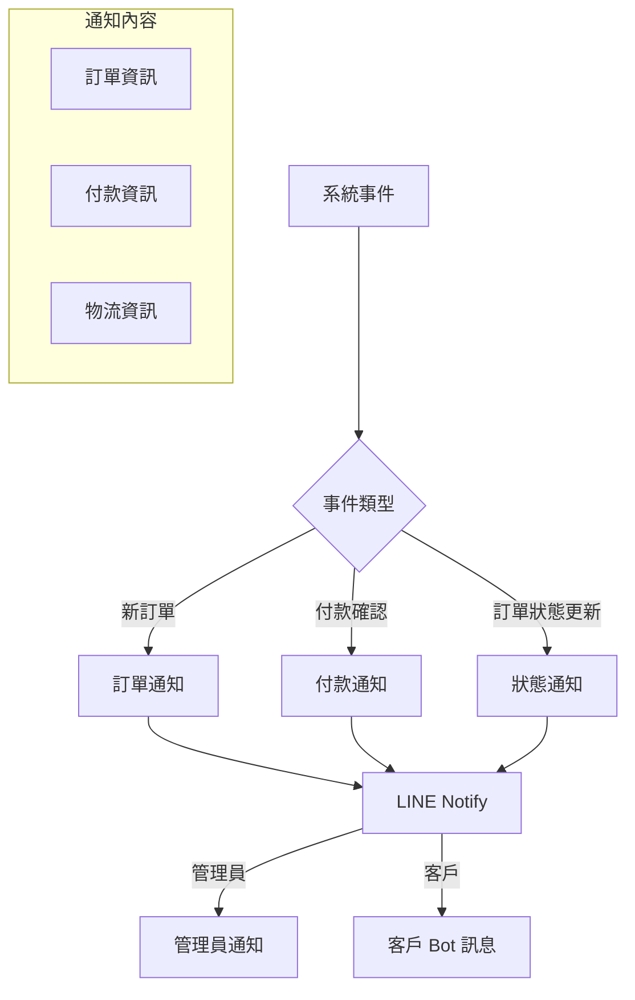
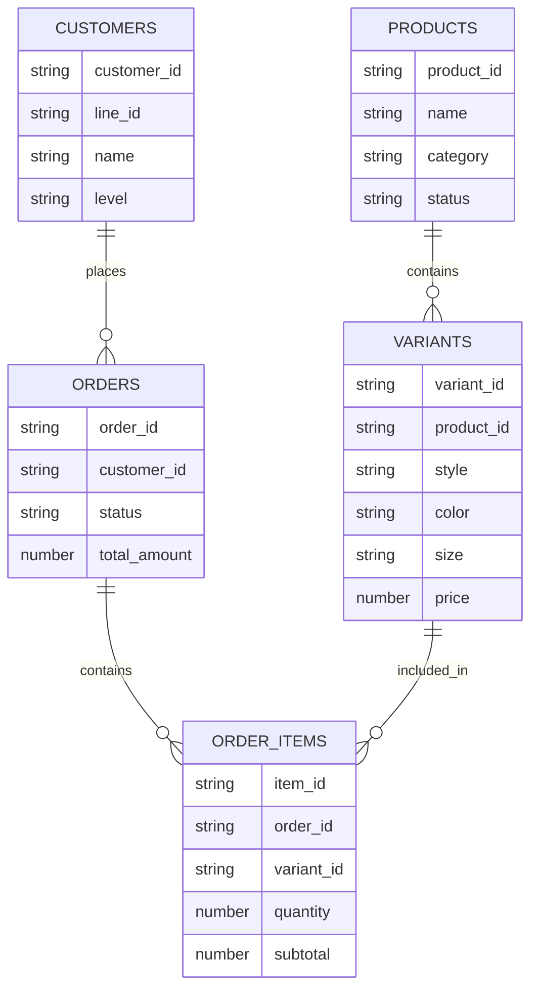
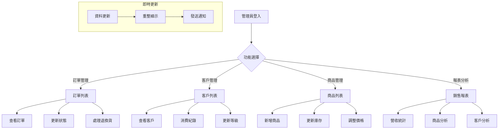

# 系統流程圖集

## 1. 整體系統流程

```mermaid
graph TD
    A[用戶] -->|發送「我要下單」| B[顯示商品分類選單]
    B --> C{選擇分類}
    C -->|最新商品| D[商品輪播]
    C -->|經典商品| D
    C -->|特價商品| D
    C -->|一般衣物| D
    C -->|連身套裝| D
    D --> E[選擇主商品]
    E --> F[顯示款式選擇]
    F --> G[選擇具體款式]
    G --> H[加入購物車]
    H --> I{購物車操作}
    I -->|繼續購物| C
    I -->|查看購物車| J[購物車管理]
    J --> K{購物車操作}
    K -->|修改數量| J
    K -->|移除商品| J
    K -->|清空購物車| J
    K -->|結帳| L[結帳流程]
```

## 2. 商品選擇流程

```mermaid
graph TD
    A[主商品資料庫] -->|關聯| B[商品變體資料庫]
    C[用戶選擇分類] --> D[顯示主商品輪播]
    D -->|選擇商品| E[查詢變體資料]
    E --> F{款式選擇}
    F -->|選擇款式| G[顯示顏色尺寸]
    G -->|確認選擇| H[加入購物車]
    H --> I[更新購物車資料]
    
    subgraph 快取機制
    J[商品快取] -->|5分鐘| K[重新獲取]
    K --> J
    end
```

## 3. 購物車管理流程

```mermaid
graph TD
    A[購物車] -->|查看| B[顯示購物車 Flex Message]
    B --> C{操作選擇}
    C -->|增加數量| D[更新數量]
    C -->|減少數量| D
    C -->|移除商品| E[刪除商品]
    C -->|清空購物車| F[清空]
    C -->|結帳| G[進入結帳流程]
    
    D --> H[重新計算金額]
    E --> H
    F --> H
    H --> I[更新購物車顯示]
    
    subgraph 購物車資料
    J[Map儲存] -->|userId| K[購物車內容]
    K -->|商品資料| L[價格小計]
    end
```

## 4. 結帳流程

```mermaid
graph TD
    A[開始結帳] --> B{檢查既有客戶}
    B -->|是| C[顯示既有資料]
    B -->|否| D[收集新資料]
    
    C --> E[確認收件資訊]
    D --> E
    
    E --> F{選擇配送方式}
    F -->|宅配| G[填寫地址]
    F -->|店到店| H[選擇門市]
    
    G --> I[訂單預覽]
    H --> I
    
    I --> J{選擇付款方式}
    J -->|銀行轉帳| K[顯示帳號]
    J -->|貨到付款| L[建立訂單]
    
    K --> L
    L --> M[清空購物車]
    M --> N[發送訂單通知]
    
    subgraph Notion資料庫
    O[建立客戶資料]
    P[建立訂單]
    Q[建立訂單項目]
    end
    
    L --> O
    O --> P
    P --> Q
```

## 5. 通知流程

```mermaid
graph TD
    A[系統事件] --> B{事件類型}
    B -->|新訂單| C[訂單通知]
    B -->|付款確認| D[付款通知]
    B -->|訂單狀態更新| E[狀態通知]
    
    C --> F[LINE Notify]
    D --> F
    E --> F
    
    F -->|管理員| G[管理員通知]
    F -->|客戶| H[客戶 Bot 訊息]
    
    subgraph 通知內容
    I[訂單資訊]
    J[付款資訊]
    K[物流資訊]
    end
```

## 6. 資料庫關聯

```mermaid
erDiagram
    PRODUCTS ||--o{ VARIANTS : contains
    CUSTOMERS ||--o{ ORDERS : places
    ORDERS ||--o{ ORDER_ITEMS : contains
    VARIANTS ||--o{ ORDER_ITEMS : included_in
    
    PRODUCTS {
        string product_id
        string name
        string category
        string status
    }
    
    VARIANTS {
        string variant_id
        string product_id
        string style
        string color
        string size
        number price
    }
    
    CUSTOMERS {
        string customer_id
        string line_id
        string name
        string level
    }
    
    ORDERS {
        string order_id
        string customer_id
        string status
        number total_amount
    }
    
    ORDER_ITEMS {
        string item_id
        string order_id
        string variant_id
        number quantity
        number subtotal
    }
```

## 7. 管理後台流程

```mermaid
graph TD
    A[管理員登入] --> B{功能選擇}
    
    B -->|訂單管理| C[訂單列表]
    C --> C1[查看訂單]
    C --> C2[更新狀態]
    C --> C3[處理退換貨]
    
    B -->|客戶管理| D[客戶列表]
    D --> D1[查看客戶]
    D --> D2[消費紀錄]
    D --> D3[更新等級]
    
    B -->|商品管理| E[商品列表]
    E --> E1[新增商品]
    E --> E2[更新庫存]
    E --> E3[調整價格]
    
    B -->|報表分析| F[銷售報表]
    F --> F1[營收統計]
    F --> F2[商品分析]
    F --> F3[客戶分析]
    
    subgraph 即時更新
    G[資料更新] --> H[重整顯示]
    H --> I[發送通知]
    end
```
